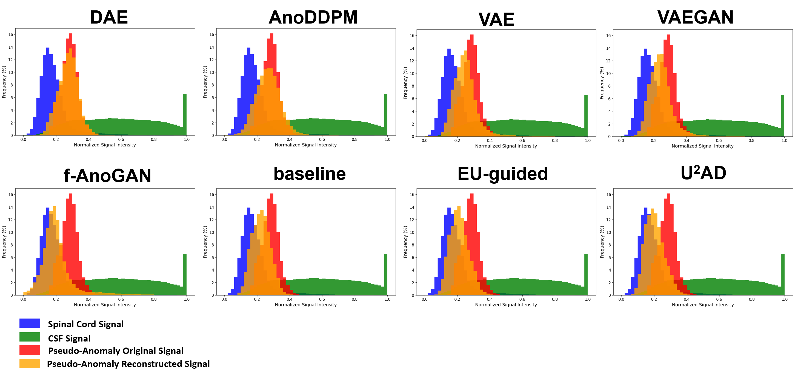

# U²AD: Uncertainty-based Unsupervised Anomaly Detection for T2 Hyperintensity in Spinal Cord MRI

[](LICENSE)

**U²AD** is a novel Vision Transformer-based framework for detecting T2 hyperintensities in spinal cord MRI through uncertainty-guided unsupervised learning. It addresses domain shifts in clinical datasets via a "mask-and-reconstruction" paradigm with dual-uncertainty guidance, achieving state-of-the-art performance in both patient-level identification and segment-level localization.

---

## 🚀 Key Features
- **Uncertainty-Guided Masking**: 
  - **Epistemic Uncertainty (EU)**: Prioritizes low-confidence regions for robust adaptation.
  - **Aleatoric Uncertainty (AU)**: Amplifies anomalies by excluding high-error regions.
- **Two-Stage Training**:
  - **Pretraining**: Learns normal anatomical representations from public healthy datasets.
  - **Adaptation**: Optimizes for clinical datasets using uncertainty maps.
- **Monte Carlo Inference**: Estimates pixel-level uncertainty via 10x stochastic reconstructions.
- **Clinical Integration**: Validated on DCM datasets with manual annotations from multiple hospitals.

---

## 🛠️ Architecture


### Core Components
1. **ViT Encoder-Decoder**:
   - 75% patch masking during training
   - Edge reconstruction loss for anatomical details
2. **Uncertainty Estimation**:
   - **EU Map**: Model confidence variance via MC sampling
   - **AU Map**: Absolute reconstruction error
3. **Adaptation Strategies**:
   - **EU-Guided**: Focuses on complex normal regions
   - **AU-Guided**: Preserves anomaly reconstruction errors
4. **Postprocessing**:
   - Anomaly curve generation along spinal cord axis
   - Segment-level (C2-T1) and patient-level scoring

### 🔑 Key Innovations

1. **Domain Shift Robustness**  
   First UAD framework trained/tested on the same clinical dataset, overcoming signal distribution differences between public healthy data (Spine Generic) and hospital-specific MRI scanners.

2. **Dual-Uncertainty Synergy**  
   EU reduces false positives by improving normal region reconstruction, while AU prevents anomaly overfitting, achieving **85.6% specificity** on sparse anomaly datasets.

3. **Clinical-Grade Quantification**  
   Provides interpretable metrics:
   - Patient-level F1: 83.4% (RenjiDCM)
   - Segment-level F1: 73.5% (RenjiDCM)
   Outperforms Object-based methods including YOLOv8, Mask R-CNN, and DETR in annotation-sparse scenarios.


---

## 🚀 Quick Start

### Installation

```bash
git clone https://github.com/zhibaishouheilab/U2AD.git
cd U2AD
pip install -r requirements.txt  # PyTorch, NiBabel, SimpleITK, OpenCV
```

### Data Preparation

#### Dataset Structure
- **Public**: Spine Generic T2w
- **Private**: Organize clinical data as:
Organize data as:

```
datasets/
  ├── public/
  │   ├── images/       # .nii.gz files
  │   └── labels/       # SC/CSF masks
  └── private/
      ├── images/       # Clinical MRIs
      └── labels/       # SC/CSF masks
```

#### Preprocessing
```bash

# Convert to numpy arrays
python datasets/preprocess_public.py  # Public data
python datasets/preprocess_private.py # Clinical data
```
Processed data saved to `data/public/` and `data/private/`.

### 🧠 Model Training

**Pretraining (Healthy Data)**:
```bash
python pre-train.py 
```
Checkpoints saved as  `weights/pretrain/MAE.pth`.

**Adaptation (Clinical/Target Data)**:

```bash
python ada-train.py
```

Checkpoints saved as  `weights/adaptation_private/MAE.pth`.

### 🔍 Inference


```bash
python infer.py
```


## 📊 Results

### Qualitative Comparison
Examples of reconstruction results and anomaly maps generated by different UAD models.


Signal intensity distributions of different regions in the pseudo-anomaly dataset.


### Quantitative Results (RenjiDCM Dataset)

| Method   | Patient-Level F1 ↑  | Segment-Level F1 ↑ |
|----------|---------------------|--------------------|
| U²AD     | 0.8336              | 0.7345             | 
| AnoDDPM  | 0.7519              | 0.4796             | 
| DETR     | 0.7800              | 0.7332             | 

### Uncertainty Ablation (RenjiDCM Dataset)

| Configuration | SSIM ↑ | Patient-level F1 ↑ |
|---------------|--------|--------------------|
|   baseline    | 0.747  |        0.8127      |
| + EU-Guided   | 0.760  |        0.8170      |
| + AU-Guided   | 0.764  |        0.8336      |


---

## 📜 Citation

```bibtex
@article{zhang2025u2ad,
  title={U²AD: Uncertainty-guided Unsupervised Anomaly Detection for T2 Hyperintensity in Spinal Cord MRI},
  author={Zhang, Qi and Chen, Xiuyuan and He, Ziyi and Wang, Kun and Wu, Lianming and Shen, Hongxing and Sun, Jianqi},
  journal={arXiv preprint arXiv:XXXX.XXXX},
  year={2025}
}
```

## 📧 Contact
If you have any questions about the codes or paper, please let us know via [zhi-bai-shou-hei@sjtu.edu.cn](zhi-bai-shou-hei@sjtu.edu.cn).

---

## 📄 License

This project is licensed under the MIT License. See [LICENSE](LICENSE) for details.
